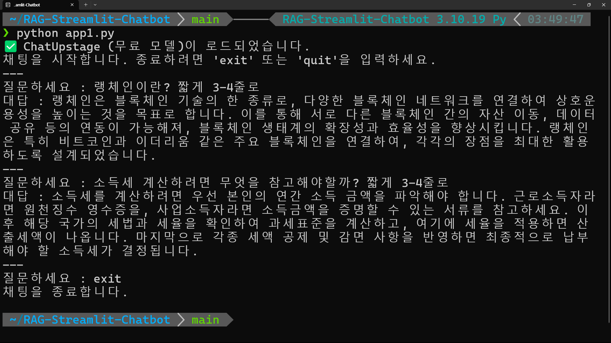
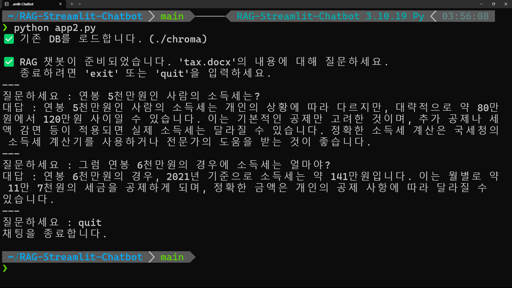

# RAG 챗봇 with LangChain, Upstage, and Streamlit

이 프로젝트는 LangChain과 Streamlit을 사용하여 구현한 RAG (Retrieval-Augmented Generation) 챗봇입니다.

Upstage AI의 API를 활용하여 두 가지 버전의 챗봇을 구현합니다.
* **`app1.py`**: Upstage의 무료 LLM(`solar-1-mini`)을 사용하는 간단한 무한루프 챗봇입니다.
* **`app2.py`**: `tax.docx` 문서를 기반으로 답변하는 CLI(터미널) 기반 RAG 챗봇입니다.

---

## 🛠️ 공통 설치 가이드 (필수)

`app1.py`와 `app2.py`를 실행하기 위해 필요한 공통 설정입니다.

### 1. Upstage API 가입 및 키 발급

이 프로젝트는 Upstage API를 사용합니다.
1.  **[Upstage Console](https://console.upstage.ai/)**에 가입합니다.
2.  가입 시 **$10의 무료 크레딧**이 지급됩니다. (2025년 11월 기준)
3.  `API keys` 메뉴에서 비밀 API 키를 발급받습니다.

### 2. Python 가상환경 설정 (`pyenv` 권장)

이 프로젝트는 **Python 3.10** 버전을 기준으로 합니다. `pyenv`를 사용하여 가상환경을 구성하는 것을 강력히 권장합니다.

```bash
# (예시) pyenv로 Python 3.10.19 설치
pyenv install 3.10.19

# 'RAG-Streamlit-Chatbot' 이름으로 가상환경 생성 (중요!)
pyenv virtualenv 3.10.19 RAG-Streamlit-Chatbot
```
> **Note**: 이 저장소에 포함된 `.python-version` 파일이 pyenv에 의해 인식되어,
> 이 폴더에 진입 시 `RAG-Streamlit-Chatbot` 가상환경이 자동으로 활성화됩니다.

### 3. 의존성 라이브러리 설치

가상환경이 활성화된 상태에서, 이 저장소에 포함된 `requirements.txt` 파일을 이용해 필요한 모든 라이브러리를 설치합니다.

```bash
pip install -r requirements.txt
```

### 4. API 키 설정 (.env 파일)

프로젝트 루트 디렉터리(이 `README.md` 파일이 있는 곳)에 **`.env`**라는 이름의 새 파일을 만듭니다. (`.gitignore`에 의해 이 파일은 GitHub에 올라가지 않습니다.)

`.env` 파일 안에 1단계에서 발급받은 API 키를 다음과 같이 입력하고 저장합니다.

```bash
UPSTAGE_API_KEY="sk-여러분의-업스테이지-API-키"
```

---
## 🚀 App 1: `app1.py` (기본 챗봇)

* **기능**: Upstage의 `solar-1-mini` 모델을 사용하는 간단한 CLI 챗봇입니다.
* **과금**: **무료**입니다. `solar-1-mini` 모델은 무료 티어로 제공되므로 크레딧이 차감되지 않습니다.

### 실행 방법

```bash
python app1.py
```

### 실행 화면

터미널에 "질문하세요 :" 프롬프트가 나타나며, 'exit' 입력 전까지 무한으로 대화를 이어갈 수 있습니다.



---
## 🚀 App 2: `app2.py` (RAG 챗봇 - CLI)

* **기능**: `tax.docx`(소득세법) 문서를 기반으로 질문에 답변하는 RAG 챗봇입니다.
* **로직**:
    1.  스크립트 실행 시, `chroma/` DB 폴더가 있는지 확인합니다.
    2.  **폴더가 없으면 (최초 1회)**: `tax.docx` 문서를 로드/분할하고, `UpstageEmbeddings`를 호출하여 문서를 벡터화한 뒤 `chroma/` 폴더에 영구 저장합니다.
    3.  **폴더가 있으면**: 기존 `chroma/` DB를 즉시 로드합니다.
    4.  무한루프 질문 프롬프트가 실행됩니다.

### 💰 App 2 과금 정책 (중요!)

이 앱은 **$10 무료 크레딧**을 사용합니다.

* **임베딩 (유료)**: `UpstageEmbeddings` (model=`solar-embedding-1-large`) 모델을 사용합니다.
    * **최초 1회**: `tax.docx` 문서를 벡터화하여 `chroma/` 폴더에 저장할 때 과금이 발생합니다. (예: 약 $0.03 차감)
    * **매 질문마다**: 사용자가 입력한 `query`(질문)를 벡터화할 때마다 소액의 과금이 발생합니다. (예: 약 $0.0001 차감)

* **LLM (무료)**: `ChatUpstage()` 모델을 사용합니다.
    * RAG가 찾은 문서 조각과 질문을 `solar-1-mini` (무료 LLM)에 전달하여 답변을 생성하므로, 이 단계에서는 과금이 발생하지 않습니다.

### 실행 방법

```bash
python app2.py
```

### 실행 화면

최초 실행 시 DB를 생성(또는 로드)한 후, 질문 프롬프트가 나타납니다.

